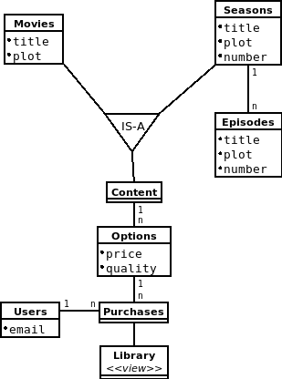
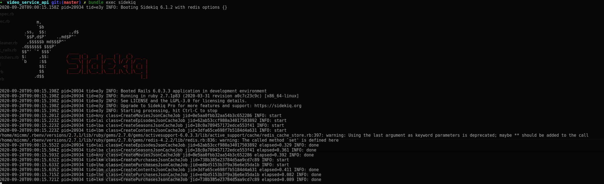
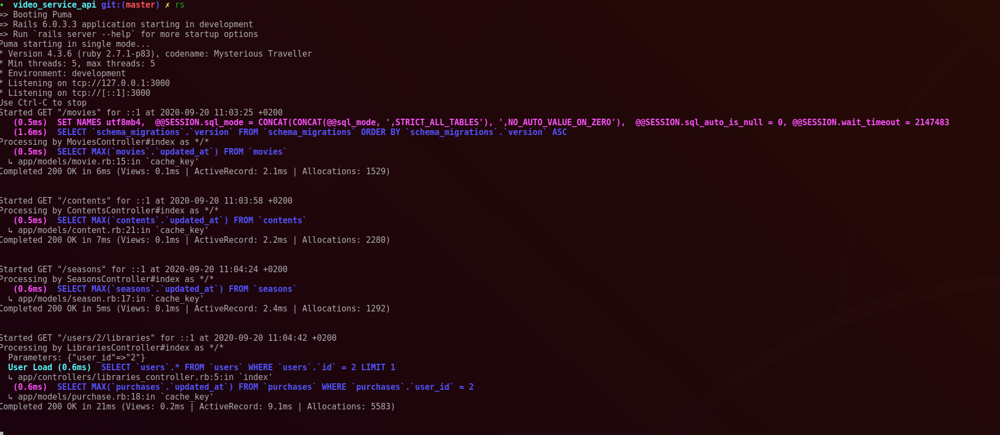
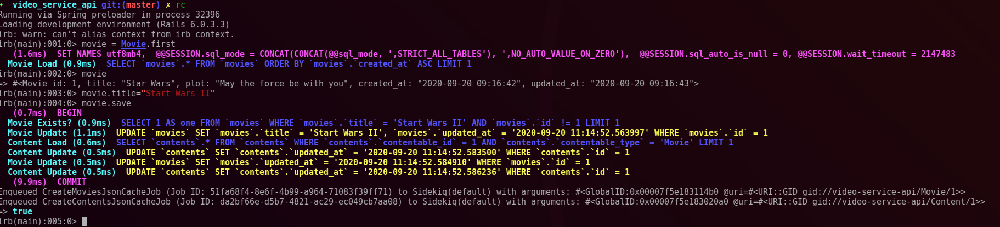

# README

This test application represent a video service RESTful api made in Ruby on Rails with the next characteristics:

## 1.- Specifications

* Ruby version
	* 2.7.1
* Rails version
	* 6.0.3.3

* System dependencies
	* MySQL database
	* Redis database

## 2.- Configuration


### External dependencies

In order to facilitate the external dependencies installation, there is a docker-compose.yml file in the project root that can be executed with Docker CE and Docker Compose if there are installed. For doing it, just create the following folders in the place where the `docker-compose.yml` be located.

We can create the folder structure through the next command

```command
foo@bar:~$ mkdir -p volumes/{mysql,redis}
```

The folder structure should look like this:

```
.
├── docker-compose.yml
└── volumes
    ├── mysql
    └── redis

```

The `docker-compose.yml`file has been configured with the environment variable `MYSQL_ROOT_PASSWORD`set to `root`, and both services (MySQL and Redis) with their defaults ports.

```yaml
version: '3'

services:
  mysqlServer:
    image: mysql:latest
    container_name: "mysql_latest"
    volumes:
      - mysql_data:/var/lib/mysql
    ports:
      - "3306:3306"
    environment:
      - MYSQL_ROOT_PASSWORD=root
  redis:
    image: redis
    container_name: "redisdb"
    volumes:
      - redis_data:/data
    ports:
      - "6379:6379" 

volumes:
  mysql_data:
    driver: local
    driver_opts:
      type: 'none'
      o: 'bind'
      device: '$PWD/volumes/mysql'
  redis_data:
    driver: local
    driver_opts:
      type: 'none'
      o: 'bind'
      device: '$PWD/volumes/redis'

```

Once the folders structure is created, just execute the next command to start the services:

```command
foo@bar:~$ docker-compose up -d
```

You can check if the services are up and running executing the next command:


```command
foo@bar:~$ docker ps
CONTAINER ID        IMAGE               COMMAND                  CREATED             STATUS              PORTS                               NAMES
b15833cbca18        redis               "docker-entrypoint.s…"   2 days ago          Up 31 minutes       0.0.0.0:6379->6379/tcp              redisdb
031259282cf6        mysql:latest        "docker-entrypoint.s…"   3 weeks ago         Up 31 minutes       0.0.0.0:3306->3306/tcp, 33060/tcp   mysql_latest
```

### Project

Clone the project and install the ruby version specified in the *specification* section in you system. Once installed, execute the next command:

```command
foo@bar:~$ bundle install
```

### Database creation and initialization

For the database creation execute the next command in the project folder:

```command
foo@bar:~$ rake db:migrate:reset && rake db:seed
```

### Run the test suite

Tests have been implemented with *Rspec* and doing the code coverage with *Simplecov*. To run the test suite, execute the next command and after execution check the coverage in the next path `<project_folder>/coverage/index.html`

```command
foo@bar:~$ bundle exec rspec
```

### Services

For caching purposes we have used Sidekiq as a background mechanism to create all the caches dependencies, i.e: when the cache for the episodes be expired due to a creation/deletion/update operation in the database, all the new caching dependant of episodes will be created again as a background process: *episodes &rarr; season &rarr; content cache.*

To execute *Sidekiq* execute this command in your shell:

```command
foo@bar:~$ bundle exec sidekiq
```

### Application

To run the application, in the root project folder execute the next command:


```command
foo@bar:~$ rails server
```


## 3.- Application Design

### Models

The application has been modeled following the next diagram:



* The IS-A relationship has been implemented through a polymorphic associations in the database
* The table *Library* that represent the user purchases that hasn't expired yet, has been implemented through the creation of a view with the gem *scenic-mysql_adapter*

### Endpoints

The endpoints created for the applications are: 

HTTP Verb | Path                               | Controller#Action        | Used for                                    
--------- | ---------------------------------- | ------------------------ | --------------------------------------------
GET       | /api/v1/contents                   | api/v1/contents#index    | display a list of all contents (Movies and Seasons) ordered by date creation             
GET       | /api/v1/movies                     | api/v1/movies#index      | display a list of Movies ordered by creation
GET       | /api/v1/seasons                    | api/v1/seasons#index     | display a list of Seasons ordered by creation including the list of episodes ordered by number
POST      | /api/v1/purchases                  | api/v1/purchases#create  | perform a purchase of a content if there is already in the user library
GET       | /api/v1/users/:user_id/libraries   | api/v1/libraries#index   | get the user library ordered by the remaining time to watch the content


### Caching

There are two types of catching in the application, both use Redis as caching storage:

#### Json Serializers caching

To serialize the json responses we have used the gem *fast_jsonapi*, that is supposed to be `25 times` faster than the Active Model serializers, and it allow us to set a cache for the serialization itself.

We set the cache in the Serializer class through the next setting:

```ruby
class MovieSerializer
  include FastJsonapi::ObjectSerializer
	cache_options enabled: true, cache_length: 1.hour
```
We have set in this case a TTL of 1 hour for the cache register for an example purpose, but it also will expire and be regenerated if there's a modification with a CRUD operation. 
We'll do that implementing the required `cache_key` method in the corresponding model.


#### Controller responses caching

The second caching type is at controller responses level. This caching will be created in the application startup through a background process in *Sidekiq*. We'll add the background caching creation in the *application.rb* file to have the cache ready at startup.

```ruby
#config/application.rb

config.after_initialize do
    CreateMoviesJsonCacheJob.perform_later
    CreateEpisodesJsonCacheJob.perform_later
    CreateSeasonsJsonCacheJob.perform_later
    CreateContentsJsonCacheJob.perform_later
end
```


We can see in the next picture how the processes are executed in the startup represented by the text of type:


```console
2020-09-20T11:14:52.600Z pid=32248 tid=dfk class=CreateMoviesJsonCacheJob jid=400da21d1fddbbcb10dddb98 INFO: start
2020-09-20T11:14:52.628Z pid=32248 tid=dfk class=CreateMoviesJsonCacheJob jid=400da21d1fddbbcb10dddb98 elapsed=0.029 INFO: done
```




In the corresponding controller, it will always try to get an existing response from the cache.


```ruby
json = Rails.cache.fetch(Movie.cache_key(@movies)) do
	MovieSerializer.new(@movies, options).serializable_hash.to_json
end
```


Calling to an endpoint we can see that the response it's being getting from the cache due to the only query that is done for each resource is querying the `updated_at`field of the corresponding table.





If we do a CRUD operation over a model it will fire the background process to regenerate the cache. We can see how they are enqueued with the text:


```console
Enqueued CreateMoviesJsonCacheJob (Job ID: 51fa68f4-8e6f-4b99-a964-71083f39ff71) to Sidekiq(default) with arguments: #<GlobalID:0x00007f5e183114b0 @uri=#<URI::GID gid://video-service-api/Movie/1>>
Enqueued CreateContentsJsonCacheJob (Job ID: da2bf66e-d5b7-4821-ac29-ec049cb7aa08) to Sidekiq(default) with arguments: #<GlobalID:0x00007f5e183020a0 @uri=#<URI::GID gid://video-service-api/Content/1>>
```




